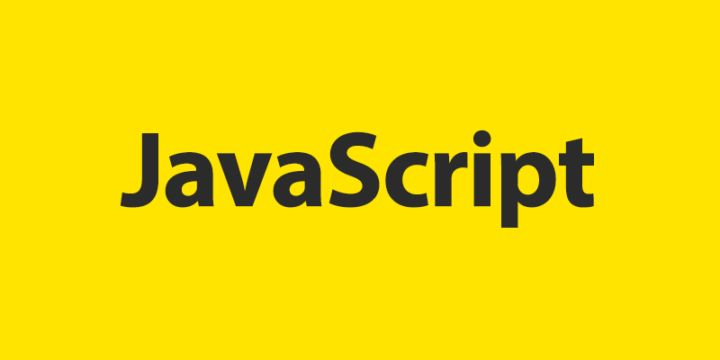
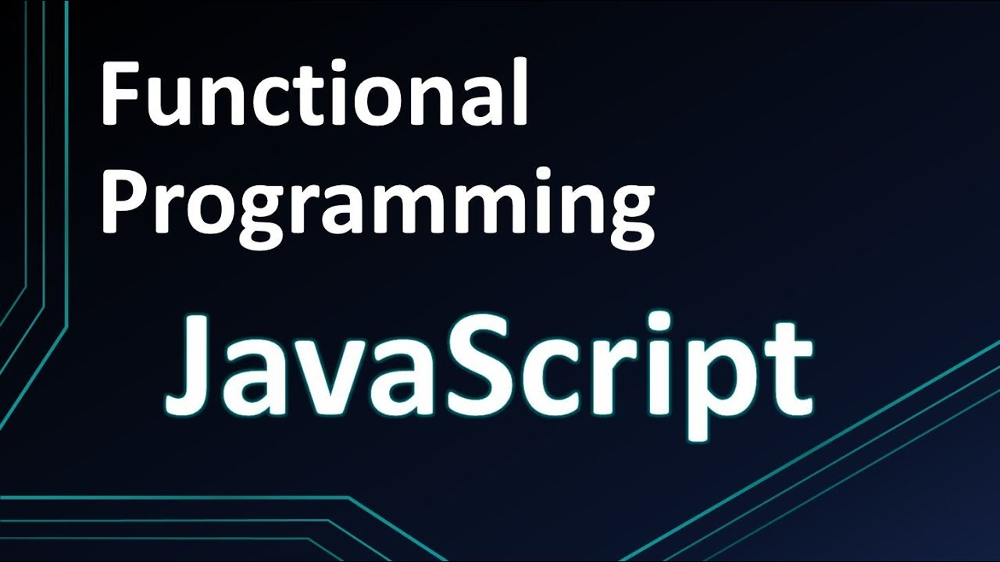
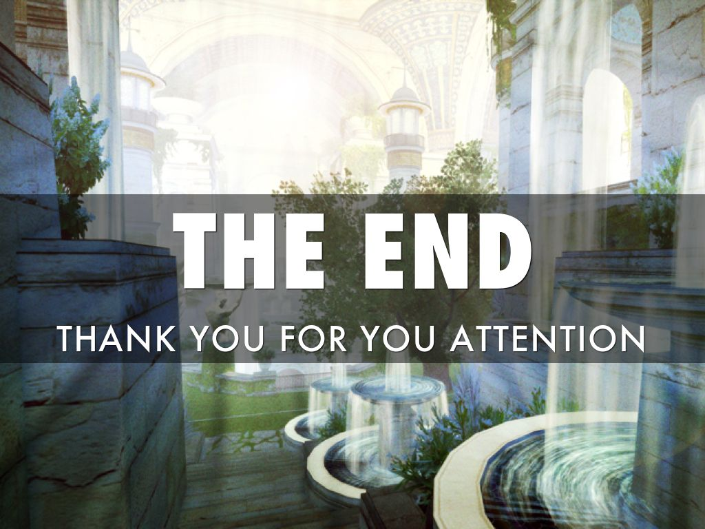

# Three important topics
## > CONDITIONS
## > LOOPS
## > FUNCTIONS

# condition if - else           
+ The if-else statement is used to
execute both the true part and the
false part of a given condition. 
-  If the
condition is true, the if block code is
executed and if the condition is false,
the else block code is executed.

.jpg)
# Condition Ternary Operator
+ An alternative to the if/else statement,
the ternary operator allows JavaScript
developers to write concise
conditional statements.

+  It is written as
“?:” and takes three operands; a
logical condition, a value to return if
true, and a value to return if false.

.jpg)
# Condition Switch case
+ The switch statement evaluates an
expression, matching the expression's
value against a series of case clauses, and
executes statements after the first case
clause with a matching value, until a
break statement is encountered.
- The
default clause of a switch statement will
be jumped to if no case matches the
expression's value

.jpg)
# Loop for
+ The for statement creates a loop that
consists of three optional expressions,
enclosed in parentheses and separated by
semicolons, followed by a statement
(usually a block statement) to be executed
in the loop.
-  The following for statement
starts by declaring the variable i and
initializing it to 0. It checks that i is less
than nine, performs the two succeeding
statements, and increments i by 1 after
each pass through the loop

.jpg)
# Loop while
+ The while statement creates a loop that
executes a specified statement as long as
the test condition evaluates to true. The
condition is evaluated before executing
the statement.
- The following while loop
iterates as long as n is less than three.
Note: Use the break statement to stop a
loop before condition evaluates to true.

.jpg)
# Loop do - while
+ The do...while statement creates a loop
that executes a specified statement until
the test condition evaluates to false. The
condition is evaluated after executing the
statement, resulting in the specified
statement executing at least once.
-  In the
following example, the do...while loop
iterates at least once and reiterates until i
is no longer less than 5.

.jpg)
# There are 3 ways of creating a function in JavaScript
## 1. > Function Declaration
## 2. > Function Expression
## 3. > (IIFE) Immediately Invoked Function Expression
.jpg)
# Function Declaration
+ The function declaration defines a function
with the specified parameters. A function
is declared using the function keyword.
The basic rules of naming a function are
similar to naming a variable.
-  It is better to
write a descriptive name for your function.
For example, if a function is used to add
two numbers, you could name the
function add or addNumbers.

.jpg)
# Function Expression
+ A function expression is very similar to and
has almost the same syntax as a function
declaration.
-   The main difference between
a function expression and a function
declaration is the function name, which
can be omitted in function expressions to
create anonymous and arrow functions.

.jpg)
# FUNCTIONS IIFE
+ An IIFE (Immediately Invoked Function
Expression) is a function that runs the
moment it is invoked or called in the
JavaScript event loop.
- Having a function
that behaves that way can be useful in
certain situations. IIFEs prevent pollution
of the global JS scope.

.jpg)

